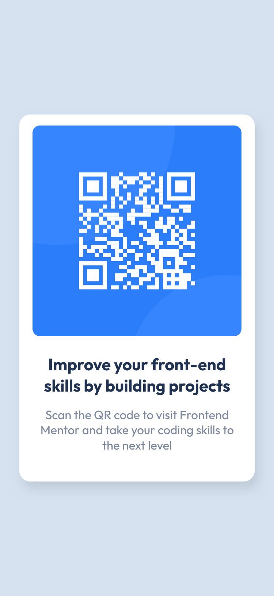

# Frontend Mentor - QR code component solution

This is a solution to the [QR code component challenge on Frontend Mentor](https://www.frontendmentor.io/challenges/qr-code-component-iux_sIO_H).

## Table of contents

- [Overview](#overview)
  - [Screenshot](#screenshot)
  - [Links](#links)
- [My process](#my-process)
  - [Built with](#built-with)
  - [What I learned](#what-i-learned)
- [Author](#author)

## Overview

### Screenshot

#### Desktop Design


#### Mobile Design
<p align="center">
  
</p>

### Links

- Live Site URL: [QR Component](https://amitsgh.github.io/qr-code-component/)

## My process

### Built with

- Semantic HTML5 markup
- CSS custom properties
- Flexbox

### What I learned
 - how to pre-define variables 
 - how flexbox and flexbox items works
 - difference btw justify-content and align-items


#### Flexbox
```css
body {
    display: flex;
    justify-content: center;
    align-items: center;
    min-height: 100vh;
    text-align: center;
    background-color: var(--color-background);
    font-family: var(--font-family);
}
```

#### Variables Pre-define
```css
/* variables */
:root {
    --font-family: 'Outfit', sans-serif;
    --font-size: 15px;
    --font-weight-normal: 400;
    --font-weight-bold: 700;

    --color-primary: hsl(0, 0%, 100%); /* White */
    --color-background: hsl(212, 45%, 89%); /* Light gray */
    --color-text-light: hsl(220, 15%, 55%); /* Grayish blue */
    --color-text-dark: hsl(218, 44%, 22%); /* Dark blue */

    --card-width: 322px;
    --card-height: 500px;

    --image-width: 286px;
    --image-height: 287px;
}
```

## Author

<!-- - Website - [Amit Singh](https://www.your-site.com) -->
- Frontend Mentor - [@amitsgh](https://www.frontendmentor.io/profile/amitsgh)
- Twitter - [@amitsgh18](https://www.twitter.com/amitsgh18)
